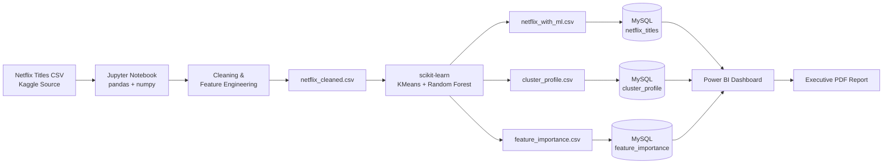
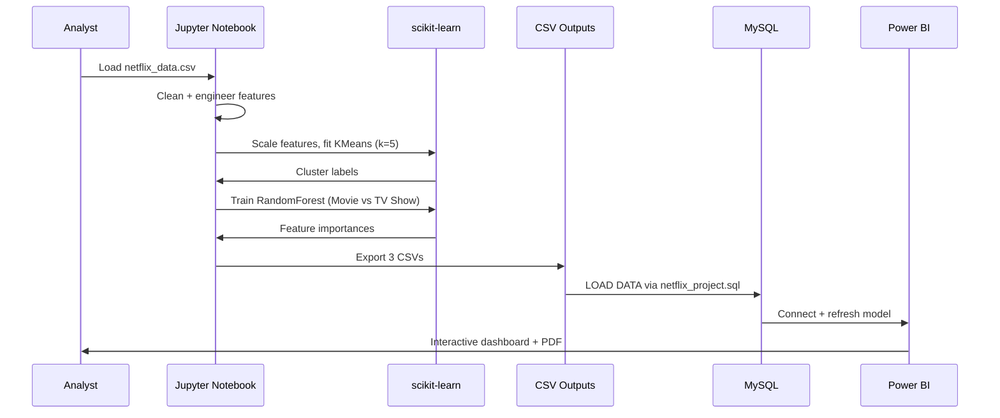
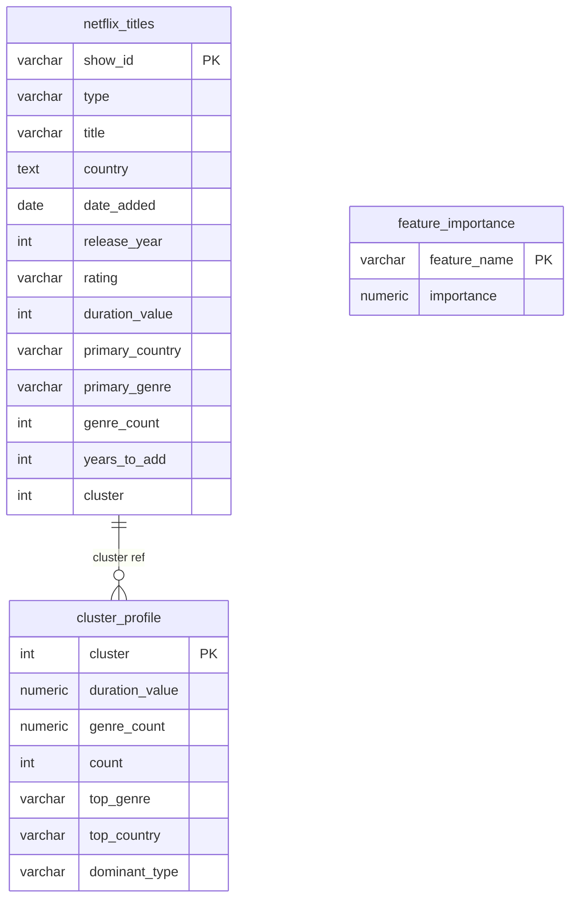
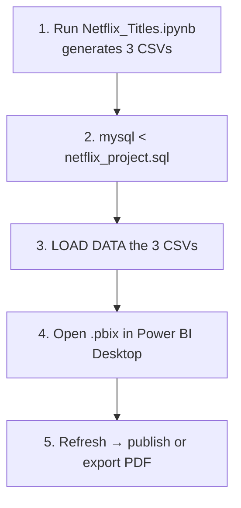

<div align="left">

# Netflix Content Intelligence Dashboard

**An end-to-end analytics pipeline that turns the raw Netflix catalog into strategic content insights — powered by Python, scikit-learn, MySQL, and Power BI.**

[](https://www.python.org/)
[](https://scikit-learn.org/)
[](https://pandas.pydata.org/)
[](https://www.mysql.com/)
[](https://powerbi.microsoft.com/)
[](https://jupyter.org/)
[](#)

</div>

---

## Table of Contents

- [Overview](#overview)
- [Problem Statement](#problem-statement)
- [Key Features](#key-features)
- [Architecture](#architecture)
- [Project Structure](#project-structure)
- [Tech Stack](#tech-stack)
- [Dataset](#dataset)
- [Data Pipeline](#data-pipeline)
- [Machine Learning Layer](#machine-learning-layer)
- [Database Layer (MySQL)](#database-layer-mysql)
- [Power BI Dashboard](#power-bi-dashboard)
- [Dashboard Preview](#dashboard-preview)
- [Installation & Setup](#installation--setup)
- [How to Reproduce End-to-End](#how-to-reproduce-end-to-end)
- [Key Insights](#key-insights)
- [Results & Model Performance](#results--model-performance)
- [Deliverables](#deliverables)
- [Limitations](#limitations)
- [Roadmap](#roadmap)
- [Contributing](#contributing)
- [License](#license)
- [Acknowledgements](#acknowledgements)

---

## Overview

The **Netflix Content Intelligence Dashboard** is a full-stack data analytics project that ingests the public Netflix titles catalog (~8,800 records), cleans and feature-engineers it, applies unsupervised and supervised machine learning to segment titles and identify what differentiates Movies from TV Shows, persists everything to a relational database, and finally surfaces the results through an interactive Power BI dashboard.

Rather than stopping at exploratory analysis, this project treats the Netflix catalog as a business asset and answers questions a real content-strategy team would ask:

- What kinds of titles dominate the catalog, and how has that mix shifted over time?
- Which countries and genres drive the library, and where is Netflix under-invested?
- Can we automatically group ~8,800 titles into a small number of interpretable **content segments**?
- Which attributes actually decide whether a title is a Movie or a TV Show?

---

## Problem Statement

Streaming catalogs contain thousands of heterogeneous titles across countries, genres, ratings, release years, and durations. Raw CSV inspection cannot answer strategic questions such as *"what type of content is Netflix over-indexing on?"* or *"what does a typical short-form comedy segment look like versus a long-form international drama segment?"*.

This project solves that gap by combining:

1. **Rigorous data cleaning** — fixing schema-shift bugs in the source file, filling missing categoricals, parsing dates and durations correctly.
2. **Feature engineering** — deriving `year_added`, `month_added`, `primary_country`, `primary_genre`, `genre_count`, `years_to_add`, and `duration_value/unit`.
3. **Machine learning** — KMeans clustering to discover latent content segments + Random Forest to quantify which features drive the Movie vs. TV Show distinction.
4. **Warehousing** — loading enriched data and ML outputs into MySQL for reproducible querying.
5. **Visualization** — a multi-page Power BI dashboard designed for non-technical stakeholders.

---

## Key Features

| Capability | Description |
|---|---|
| **Automated cleaning** | Repairs 3 known schema-shift rows, fills missing directors/cast/country/rating, parses `date_added` into proper `datetime`. |
| **Feature engineering** | Extracts primary country, primary genre, genre count, duration value/unit, catalog freshness (`years_to_add`). |
| **Unsupervised segmentation** | KMeans (k=5) groups ~8,800 titles into interpretable content segments. |
| **Supervised classification** | Random Forest predicts Movie vs. TV Show and exports feature importances. |
| **SQL-ready outputs** | Three normalized CSVs load directly into MySQL via a provided DDL script. |
| **Interactive dashboard** | Power BI `.pbix` file with KPIs, geographic distribution, genre/rating breakdowns, and cluster profiles. |
| **Executive PDF report** | Static, share-ready insights document for non-technical stakeholders. |
| **Reproducible notebook** | Single Jupyter notebook (18 cells) runs the full pipeline end-to-end. |

---

## Architecture



### Data Flow



---

## Project Structure

```
Netflix-Content-Intelligence-Dashboard-/
├── Netflix_Titles.ipynb              # End-to-end pipeline (cleaning → ML → export)
├── netflix_data.csv                  # Raw source (Kaggle Netflix catalog)
├── netflix_cleaned.csv               # Post-cleaning + feature engineering
├── netflix_with_ml.csv               # Adds encoded features + KMeans cluster labels
├── cluster_profile.csv               # Per-cluster summary (top genre/country, means)
├── feature_importance.csv            # Random Forest feature importances
├── netflix_project.sql               # MySQL DDL: staging + final tables
├── Netflix Anlysis Dashboard.pbix    # Power BI dashboard
├── Netflix_Content_Insights_Report.pdf  # Executive summary (share-ready)
├── screenshots/                      # Dashboard preview images
└── README.md
```

---

## Tech Stack

| Layer | Tools |
|---|---|
| **Language** | Python 3.9+, SQL |
| **Data Processing** | pandas, NumPy |
| **Machine Learning** | scikit-learn (`KMeans`, `RandomForestClassifier`, `LabelEncoder`, `StandardScaler`) |
| **Notebook Environment** | Jupyter / Google Colab |
| **Database** | MySQL 8.x |
| **Visualization** | Microsoft Power BI Desktop |
| **Reporting** | PDF (exported from Power BI) |
| **Version Control** | Git + GitHub |

---

## Dataset

- **Source:** [Kaggle — Netflix Movies and TV Shows](https://www.kaggle.com/code/lucifierx/netflix/input)
- **Records (raw):** 8,809
- **Records (cleaned):** 8,797
- **Columns (raw):** `show_id, type, title, director, cast, country, date_added, release_year, rating, duration, listed_in, description`

Cleaning removed a small number of rows with unrecoverable `date_added` / `duration` gaps and repaired **3 known schema-shift rows** where a duration value had leaked into the `rating` column.

---

## Data Pipeline

The pipeline is implemented in `Netflix_Titles.ipynb` and organized as discrete, idempotent cells.

### 1. Cleaning

| Step | Action |
|---|---|
| Schema-shift repair | Rows where `rating ∈ {'74 min','84 min','66 min'}` — move value back into `duration`, null out `rating`. |
| Categorical fill | `director`, `cast`, `country` → `"Not Specified"`; `rating` → mode. |
| Row drops | Remove rows still missing `date_added` or `duration` (very small count). |
| Date parsing | `date_added` → `datetime64` via explicit `%B %d, %Y` format. |

### 2. Feature Engineering

| New Column | Derivation | Purpose |
|---|---|---|
| `year_added`, `month_added` | Extracted from `date_added` | Time-series analysis |
| `duration_value`, `duration_unit` | Regex-extract number; unit inferred from `type` | Numeric duration modeling |
| `primary_country` | First entry of comma-split `country` | Reduce high-cardinality country strings |
| `primary_genre` | First entry of comma-split `listed_in` | Primary genre attribution |
| `genre_count` | Number of comma-separated genres | Content variety signal |
| `years_to_add` | `year_added − release_year`, clipped ≥ 0 | Catalog freshness signal |

### 3. Encoding & Scaling

Label encoding for `primary_country`, `primary_genre`, `rating`, `type` → integer columns. `StandardScaler` on the 7 numeric features (`duration_value`, `genre_count`, `years_to_add`, `release_year`, `country_enc`, `genre_enc`, `rating_enc`) before ML.

---

## Machine Learning Layer

### Unsupervised — KMeans Clustering (k=5)

Groups titles into 5 interpretable **content segments** based on scaled numeric + encoded features. `random_state=42`, `n_init=10`.

**Cluster profiles (from `cluster_profile.csv`):**

| Cluster | Count | Dominant Type | Top Genre | Top Country | Avg Duration | Avg Release Year | Avg Years-to-Add |
|:-:|:-:|:-:|:--|:--|:-:|:-:|:-:|
| 0 | 2,080 | TV Show | International TV Shows | United States | 5.3 seasons | 2017.1 | 1.8 |
| 1 | 1,530 | Movie | Stand-Up Comedy | United States | 37.5 min | 2016.7 | 2.0 |
| 2 | 2,228 | Movie | Dramas | United States | 99.1 min | 2014.8 | 4.1 |
| 3 |   515 | Movie | Action & Adventure | United States | 109.2 min | 1986.0 | 33.0 |
| 4 | 2,444 | Movie | Dramas | India | 110.3 min | 2015.5 | 3.4 |

Cluster 3 clearly captures the **classic / catalog** segment (avg release year 1986, 33-year lag). Cluster 4 highlights Netflix's substantial **Indian drama** footprint. Cluster 1 isolates short-form standup comedy.

### Supervised — Random Forest Classifier (Movie vs TV Show)

`RandomForestClassifier(n_estimators=200, max_depth=10, random_state=42)`, 80/20 stratified split.

**Feature importance (from `feature_importance.csv`):**

| Feature | Importance |
|---|--:|
| `duration_value` | 0.761 |
| `genre_enc` | 0.168 |
| `rating_enc` | 0.030 |
| `years_to_add` | 0.012 |
| `genre_count` | 0.011 |
| `country_enc` | 0.011 |
| `release_year` | 0.008 |

**Interpretation:** duration alone explains ~76% of the classification signal — which is expected (movies use minutes, TV shows use seasons), but importantly, genre carries meaningful independent signal (~17%), confirming Netflix has genre-format specialization (e.g. Stand-Up Comedy skews Movie; International skews TV).

---

## Database Layer (MySQL)

`netflix_project.sql` provisions the analytical schema. The design uses a **staging → final** pattern so the raw ML export can be bulk-loaded first and then projected into a clean, primary-keyed table.



### Load Sequence

```sql
-- 1. Create staging table matching netflix_with_ml.csv exactly
SOURCE netflix_project.sql;

-- 2. Load the ML-enriched CSV
LOAD DATA LOCAL INFILE 'netflix_with_ml.csv'
INTO TABLE staging_netflix
FIELDS TERMINATED BY ',' ENCLOSED BY '"'
LINES TERMINATED BY '\n'
IGNORE 1 ROWS;

-- 3. Project into netflix_titles (script handles this)
-- 4. Load cluster_profile.csv and feature_importance.csv similarly
```

Expected final row count: **8,797**.

---

## Power BI Dashboard

`Netflix Anlysis Dashboard.pbix` connects directly to the three MySQL tables and presents:

- **Overview KPIs** — total titles, Movies vs TV Shows split, countries covered, catalog span.
- **Temporal trends** — titles added per year and per month.
- **Geographic breakdown** — top producing countries (map + bar).
- **Genre landscape** — most common primary genres and genre-count distribution.
- **Rating mix** — audience-rating distribution.
- **Content segments** — cluster sizes with dominant type, top genre, and top country per cluster.
- **Model insights** — feature-importance bar chart from the Random Forest.

> A pre-rendered, share-ready version is included as `Netflix_Content_Insights_Report.pdf`.

---

## Dashboard Preview

### Full Dashboard

<p align="center">
  
</p>

At a glance: **9K total titles**, **6K Movies vs 3K TV Shows** (≈ 70.8% / 29.2%), and content sourced from **87 countries**. Global filters cover Release Year (1925–2021), Country, Type, and Rating.

---

### KPI Highlights

| Metric | Value |
|---|--:|
| Total Titles | **9K** |
| Total Movies | **6K** |
| Total TV Shows | **3K** |
| Total Countries | **87** |
| Release Year Range | **1925 – 2021** |

---

### Movies vs TV Shows

<p align="center">
  
</p>

Movies dominate the catalog at **5.32K (70.77%)** vs. TV Shows at **2.2K (29.23%)** — confirming Netflix's historically movie-heavy library composition.

---

### Titles Released Per Year

<p align="center">
  
</p>

Steep ramp-up between **2014 and 2018**, plateau through **2019–2020**, and a sharp drop in **2021** (partly a snapshot artifact, partly a post-pandemic slowdown).

---

### Top 10 Countries

<p align="center">
  
</p>

The **United States (~3K)** produces roughly 3× more titles than the second-largest source, **India (~1K)**. Together with the UK, they account for the majority of the catalog.

---

### Top 5 Genres

<p align="center">
  
</p>

**Dramas** lead the catalog (~2K titles), followed by Comedies, Action & Adventure, Documentaries, and International TV Shows.

---

### Most Common Rating

<p align="center">
  
</p>

**TV-MA (3.21K)** and **TV-14 (2.16K)** dominate — Netflix's catalog is overwhelmingly targeted at mature and teen audiences, with family/kids content forming a much smaller share.

---

### Content by Age Group

<p align="center">
  
</p>

Aggregated audience view: **Adults (~3K)** > **Teens (~2K)** > **Children (~1K)** > Kids / Unknown — reinforcing the mature-content skew visible in the rating chart.

---

## Installation & Setup

### Prerequisites

- Python **3.9+**
- MySQL **8.x** (with `LOAD DATA LOCAL INFILE` enabled)
- Microsoft **Power BI Desktop** (Windows)
- Git

### 1. Clone

```bash
git clone https://github.com/nafishaparveen2104/Netflix-Content-Intelligence-Dashboard-.git
cd Netflix-Content-Intelligence-Dashboard-
```

### 2. Python Environment

```bash
python -m venv .venv
source .venv/bin/activate           # Windows: .venv\Scripts\activate
pip install pandas numpy scikit-learn jupyter
```

### 3. Launch the Notebook

```bash
jupyter notebook Netflix_Titles.ipynb
```

> The notebook was originally authored in Google Colab. Locally, replace the `from google.colab import files` cells with standard `pd.read_csv(...)` / `df.to_csv(...)` calls.

### 4. MySQL

```bash
mysql -u root -p < netflix_project.sql
```

Then bulk-load the three CSVs as shown in [Database Layer](#database-layer-mysql).

### 5. Power BI

Open `Netflix Anlysis Dashboard.pbix` → **Transform data → Data source settings** → point to your MySQL instance → **Refresh**.

---

## How to Reproduce End-to-End



Runtime on a modern laptop: **under 2 minutes** for the full notebook (dataset is small).

---

## Key Insights

- **Movies dominate the catalog (~70/30)** but TV Show additions have grown faster in recent years.
- The **United States and India** are the two largest content sources, with India appearing as a distinct cluster driven by long-form Dramas.
- **Stand-Up Comedy** is a self-contained content segment (Cluster 1) — short, US-heavy, recent.
- A small but meaningful **classic-catalog segment** exists (Cluster 3): ~515 titles with an average 33-year lag between release and Netflix availability.
- Content additions **peaked around 2018–2020** and have plateaued since.
- Duration alone is not enough to characterize content type — **genre carries ~17% of the classification signal**, indicating genre-format specialization.

---

## Results & Model Performance

| Model | Task | Metric | Value |
|---|---|---|---|
| KMeans | Segment ~8,800 titles | k, inertia stability (`n_init=10`) | k=5, deterministic (`random_state=42`) |
| Random Forest | Movie vs TV Show | Top feature | `duration_value` (0.76) |
| Random Forest | Movie vs TV Show | Config | 200 trees, `max_depth=10`, stratified 80/20 |

The Random Forest is intentionally used as an **interpretability tool** (feature importance) rather than a production predictor — the Movie/TV distinction is a known label, and the goal is to surface *which attributes matter most*.

---

## Deliverables

| File | Purpose |
|---|---|
| `Netflix_Titles.ipynb` | Reproducible pipeline |
| `netflix_cleaned.csv` | Clean, feature-engineered dataset |
| `netflix_with_ml.csv` | Cleaned data + encoded features + cluster labels |
| `cluster_profile.csv` | Human-readable cluster summary |
| `feature_importance.csv` | Random Forest feature importances |
| `netflix_project.sql` | MySQL schema and load procedure |
| `Netflix Anlysis Dashboard.pbix` | Interactive Power BI dashboard |
| `Netflix_Content_Insights_Report.pdf` | Executive-ready static report |
| `screenshots/` | Dashboard preview images used in this README |

---

## Limitations

- The dataset is a **static Kaggle snapshot**; it does not reflect Netflix's current live catalog.
- `primary_country` and `primary_genre` intentionally reduce multi-valued fields to a single value — analyses of co-country or co-genre patterns require the raw comma-separated columns.
- KMeans `k=5` was chosen heuristically for interpretability; no silhouette/elbow sweep is included.
- The Random Forest classifies a label that is already known (`type`); its value is diagnostic, not predictive.
- No automated tests or CI — this is an analytical project rather than a service.

---

## Roadmap

- [ ] Elbow / silhouette analysis to formally justify `k`.
- [ ] Add NLP topic modeling on the `description` column (BERTopic / LDA).
- [ ] Replace label encoding with target/one-hot encoding for country and genre.
- [ ] Package the pipeline as a CLI (`typer`) with `--input` / `--output` flags.
- [ ] Automate MySQL load via `sqlalchemy` + `pandas.to_sql`.
- [ ] Dockerize the notebook environment for one-command reproducibility.
- [ ] Publish an interactive web version (Streamlit / Dash) as an alternative to Power BI.

---

## Contributing

Contributions, issues, and feature requests are welcome.

1. Fork the repository
2. Create a feature branch: `git checkout -b feat/your-idea`
3. Commit your changes: `git commit -m "feat: add ..."`
4. Push and open a Pull Request

Please keep notebook cells small, idempotent, and well-commented in the existing style.

---

## Acknowledgements

- **Dataset:** [Netflix Movies and TV Shows — Kaggle](https://www.kaggle.com/code/lucifierx/netflix/input)
- **Libraries:** pandas, NumPy, scikit-learn, Jupyter
- **Visualization:** Microsoft Power BI Desktop
- **Author:** [@nafishaparveen2104](https://github.com/nafishaparveen2104)

---

<div align="left">

**If this project helped you, please consider giving it a ⭐ on GitHub.**

</div>
